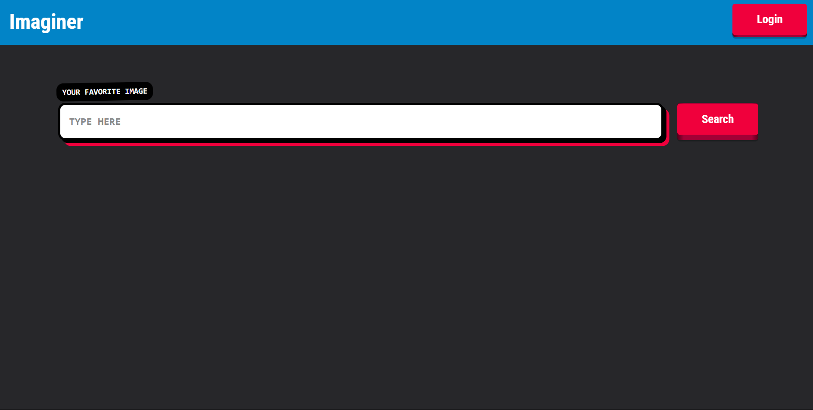
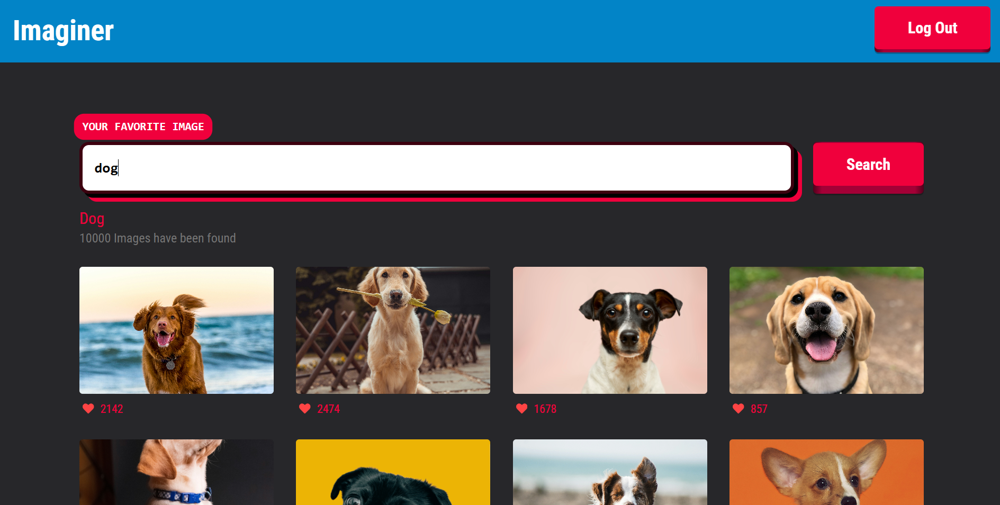
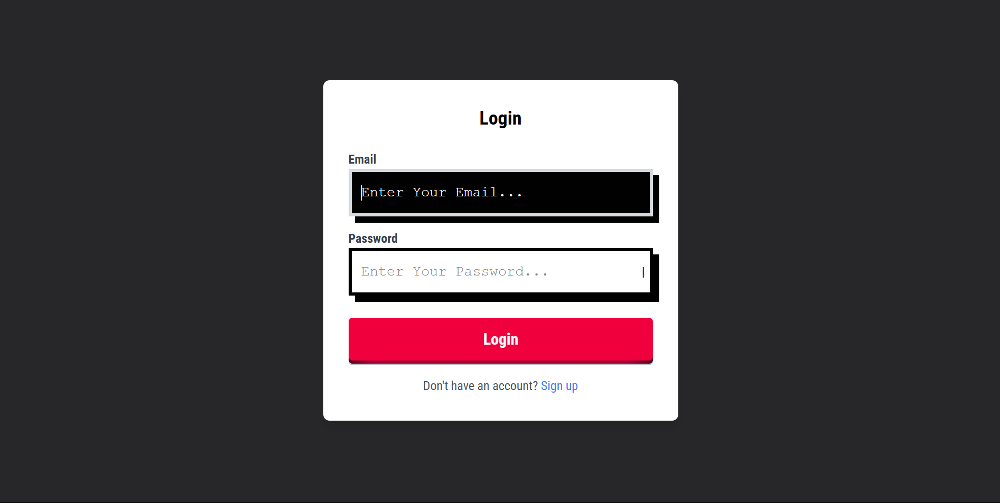
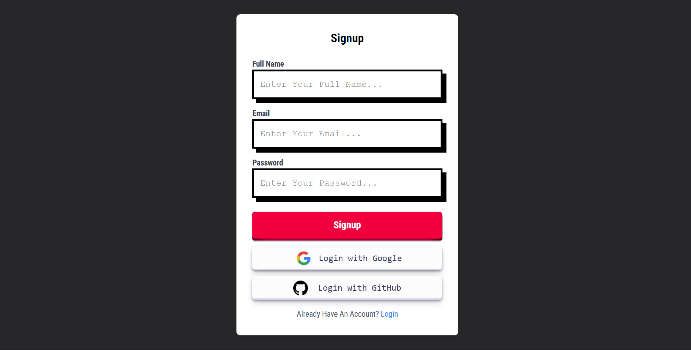

### Screenshot

<h2>Initial View</h2>

<h2>Search View</h2>

<h2>Login</h2>

<h2>Login</h2>

### Built with

- Semantic HTML5 markup
- CSS Grid
- Flex Box
- React Hooks
- Unsplash API
- Express Js
- MongoDb and mongoose
- JWT
- Passport

### Features

- Single Page Application
- Load More button will add more images when clicked
- Login and Signup

## Author

This Project Cloned From Kawtar Choubari

